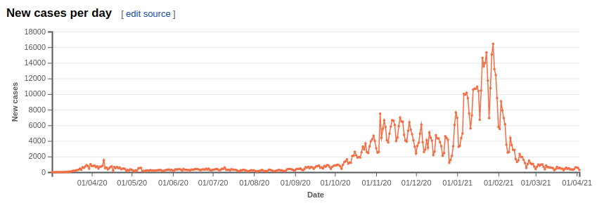
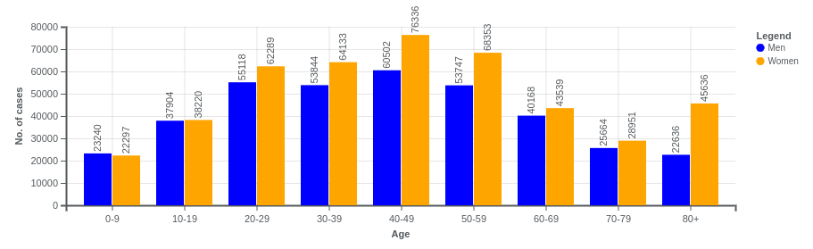
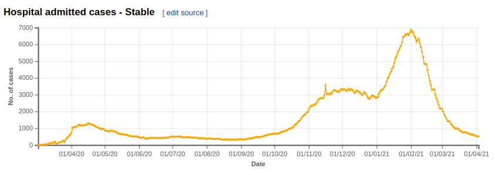

# Charts generator for Portugal's Covid-19 Wikipedia page
This project has the goal of automating the process of updating data charts for the Portugal's Covid-19 pandemic wikipedia page.

## Requirements
- Python 3
- pandas
- Beautiful Soup
- pdfminer
- requests
- pytest

## Usage
- Clone this repository and `cd` into it.
- Download the required packages with `pip3 install -r requirements.txt`.
- Run tests with `pytest -v tests/test_global.py` to check if the script works with the format from the latest DGS report.
- If all the tests pass, run the command `python3 get_data.py`.
- Go to the folder `output/` and:
    - copy the content of the file `PortugalCovid-19-Statistics.txt` into [Portugal's Covid-19 pandemic english wikipedia page](https://en.wikipedia.org/w/index.php?title=Statistics_of_the_COVID-19_pandemic_in_Portugal&action=edit)
- To contribute to the portuguese page, go to the folder `output/portuguese` and copy the content of the files `GraphsCasesByAgeAndGender.txt` and `TimelineGraphs.txt` into the sections [Casos por idade e sexo](https://pt.wikipedia.org/w/index.php?title=Pandemia_de_COVID-19_em_Portugal&action=edit&section=27) and [Gráfico da evolução dos casos](https://pt.wikipedia.org/w/index.php?title=Pandemia_de_COVID-19_em_Portugal&action=edit&section=28), respectively.

## Example of charts

## Contributions
Thanks to [hagnat](https://github.com/hagnat/) for the inspiration (he did something similar [here](https://github.com/hagnat/covid) but for the Brazilian wikipedia page).

## Change in report format (August 16th 2020)
Due to the change in the DGS report format (from August 16th onwards), a new method for parsing the PDF files and retrieving data had to be implemented. That was effectively done on August 22nd, requiring the creation of a new git branch to implement the changes (the new one has name `new-branch` and I created another branch called `old-format-16-08-20` for the state before the changes).

## To do:
- Implement testing (DONE)
- Keep track of more information over time in the .csv file - things like the evolution of cases and deaths by gender and age and by location, just to name a few

